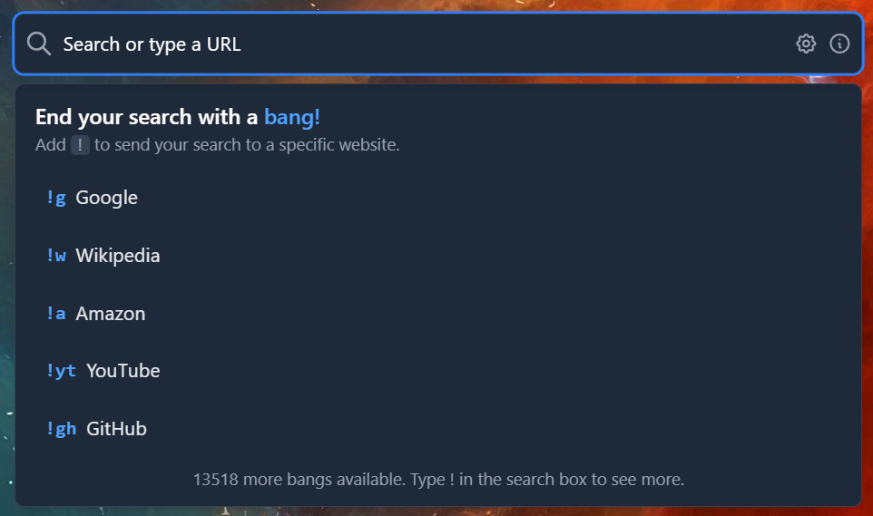
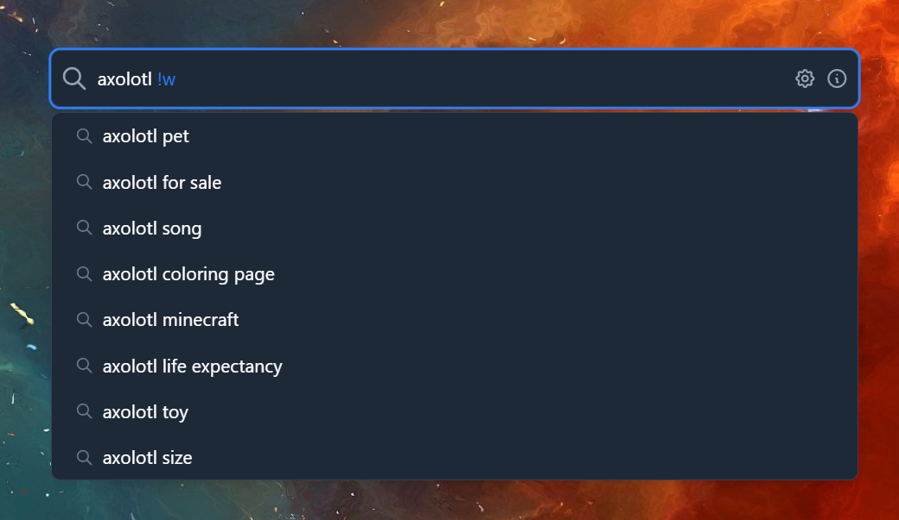
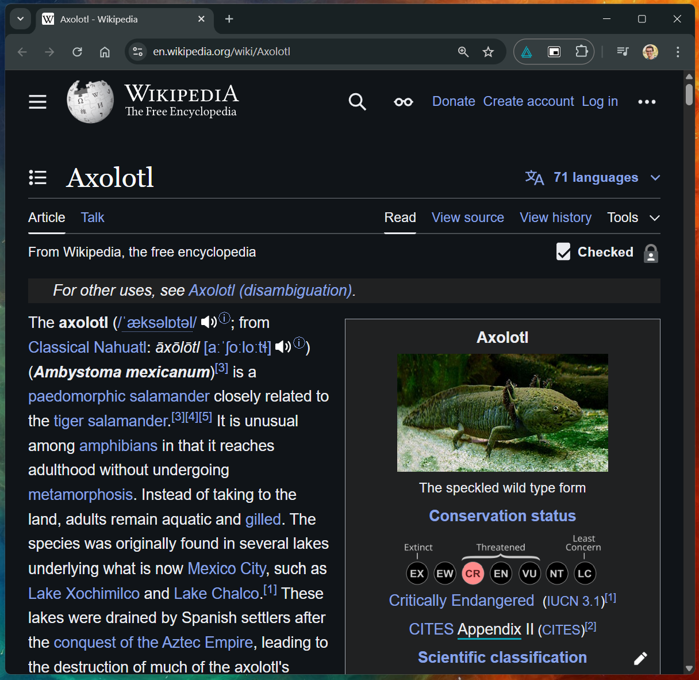
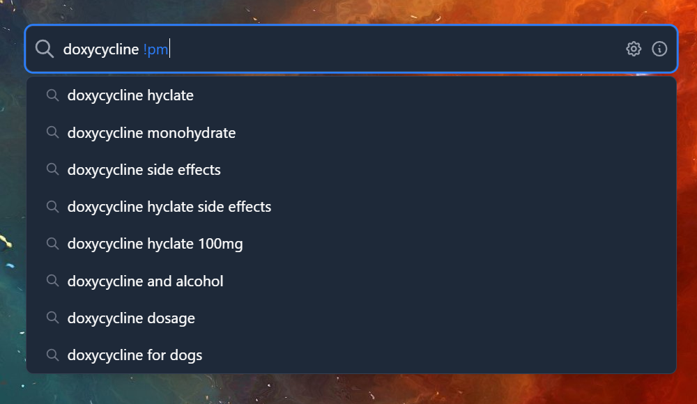
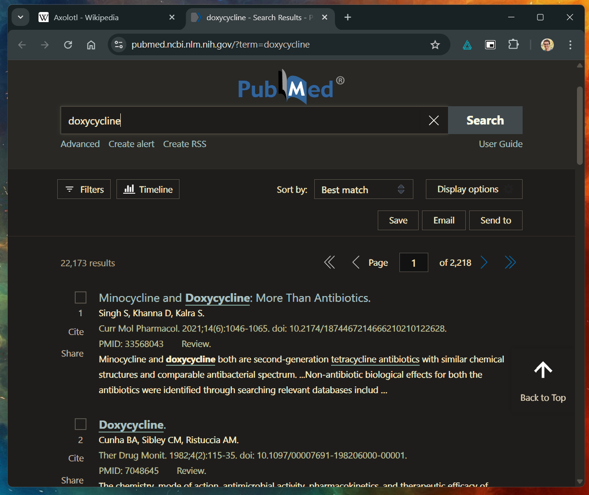

# Zephyr - One Search to Rule Them All

A featherweight search bar at your fingertips. Ditch your browser's search and go straight to the source.

<p>
  
</p>

<table width="75%">
  <tr>
    <td>
      
    </td>
    <td>
      
    </td>
  </tr>
  <tr>
    <td>
      
    </td>
    <td>
      
    </td>
  </tr>
</table>

## Summon any site, anywhere

1. Press `Ctrl + Space` from anywhere, no need to be in your browser
2. Type away, get suggestions as you type
3. Load it with bangs `!` to go straight to the site you want
4. Hit `Enter` to launch in your default browser

## Development

### Prerequisites

- [Rust](https://www.rust-lang.org/tools/install) (1.85.0+)
- [Node.js](https://nodejs.org/) or [Bun](https://bun.sh/)
- [Tauri CLI](https://tauri.app/start/)

### Setup

1. Clone the repository
2. Install dependencies:

   ```bash
   bun install
   ```

3. Run the development server:

   ```bash
   bun dev
   ```

### Building

To build the application for production:

```bash
bun run build
```

## CI/CD

This project uses GitHub Actions:

- Automatic builds are triggered on merges to the `main` branch
- Windows installers (NSIS) are automatically created
- Releases are published to GitHub Releases with versions based on the build number

To view the workflow configuration, see [.github/workflows/release.yml](.github/workflows/release.yml).
